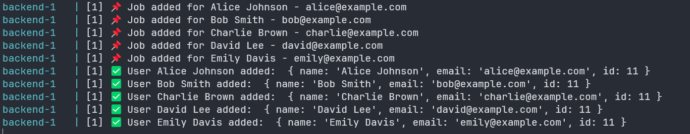

# CSV Upload & Processing with Bull Queue and Redis

## Overview

This project processes user data from a CSV file by adding jobs to a Bull queue and handling them asynchronously. The backend is built with Node.js (Express) and TypeScript, while Redis is used as a queue store via Docker. The frontend is built using Next.js with ShadCN UI for a modern and accessible design.



## Features

- Upload a CSV file with `name` and `email` fields.
- Process user data asynchronously using Bull queue.
- Store jobs in Redis (running via Docker).
- Mock API call for user creation using JSONPlaceholder.
- Frontend built with Next.js and ShadCN UI for file uploads.
- Docker Compose setup for easy containerization.

## Tech Stack

- **Backend:** Node.js (Express, TypeScript)
- **Queue:** Bull (Redis-based job queue)
- **Database (Mocked):** JSONPlaceholder
- **Frontend:** Next.js (React) with ShadCN UI
- **Containerization:** Docker & Docker Compose

## Installation & Setup

### Prerequisites

Ensure you have the following installed:

- [Node.js](https://nodejs.org/)
- [Docker & Docker Compose](https://docs.docker.com/compose/install/)
- [Git](https://git-scm.com/)

### Clone the Repository

```sh
git clone https://github.com/Artemiskgg1/csv-processing-app-contactwise.git
cd csv-processing-app-contactwise
```

### Running Locally (Without Docker)

#### Backend

```sh
cd server
npm install
npm run dev
```

- The Express server will run on `http://localhost:7000`.

#### Frontend

```sh
cd client
npm install
npm run dev
```

- The Next.js app will run on `http://localhost:3000`.

#### Redis (Without Docker)

If Redis is **installed manually**, start it using:

```sh
redis-server
```

Alternatively, if using **Docker Redis**, start a container:

```sh
docker run --name redis-container -p 6379:6379 -d redis
```

### Running with Docker

To run the entire setup using Docker:

```sh
docker-compose up --build
```

- The backend will be available at `http://localhost:7000`
- The frontend will be available at `http://localhost:3000`
- Redis will run as a container

To stop the containers:

```sh
docker-compose down
```

## API Endpoints

### Upload CSV File

**POST** `/api/csv/upload`

- Uploads a CSV file containing user data.

## Environment Variables

Create a `.env` file in the `server` directory:

```sh
PORT=7000
REDIS_URL=redis://localhost:6379  # Use this for local development (Docker Redis)
```

- In **production**, set `REDIS_URL` to your actual Redis service URL.

## License

This project is open-source and available under the [MIT License](LICENSE).
